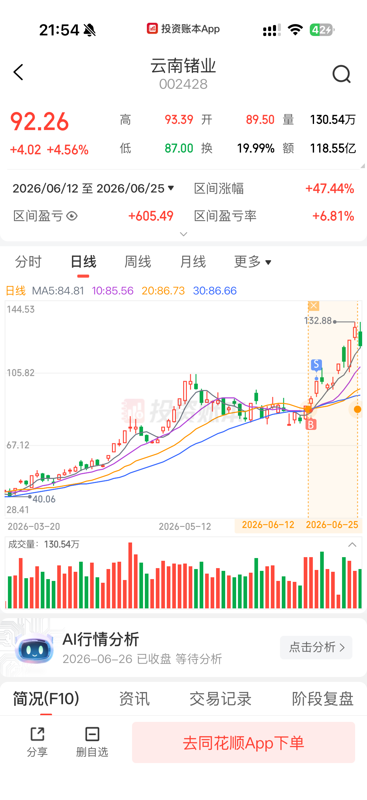
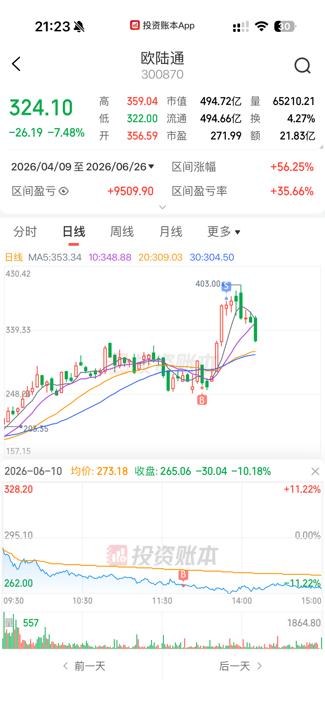
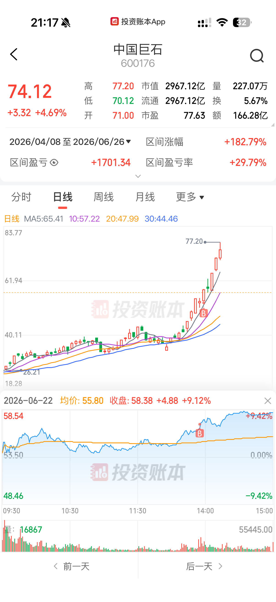
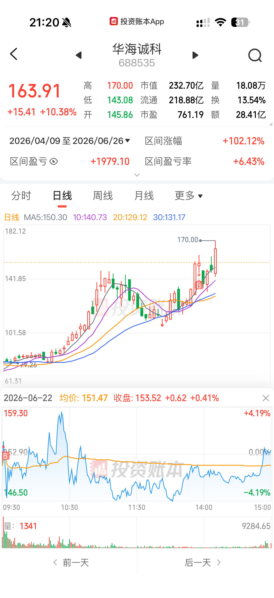
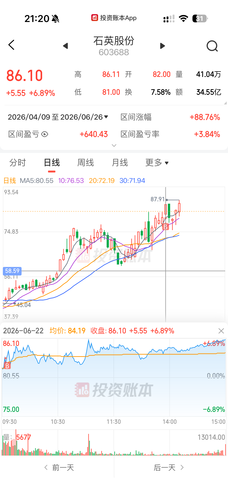

# 实战复盘 · Track Record

5 个已验证样本均为正，展示口径最高 **+37%**。

> 仅为方法演示，**不构成投资建议**；过往表现不预示未来。

| 报告 / 瓶颈 | 标的（代码） | 当时评级 | 口径 | 比例 | 报告 |
| --- | --- | --- | --- | ---: | --- |
| InP 出口管制 · 锗/InP 衬底 | 云南锗业（002428） | 弹性关注 | 区间涨幅 | **+37%** | [PDF](cases/案例_InP出口管制_A股目标价情景_20260612.pdf) |
| AI 数据中心电力 · HVDC/电源 | 欧陆通（300870） | 弹性关注 | 盈亏比例 | **+36%** | [PDF](cases/案例_AI数据中心电力_A股标的.pdf) |
| 覆铜板涨价 · 玻纤/电子布 | 中国巨石（600176） | 弹性关注 | 盈亏比例 | +30% | [PDF](cases/案例_覆铜板涨价事件快评_20260622.pdf) |
| 先进封装材料 · EMC/GMC 替代 | 华海诚科（688535） | 弹性关注 | 盈亏比例 | +6% | [PDF](cases/案例_AI算力硬件产业链瓶颈_WF6到先进封装.pdf) |
| 半导体石英 · 高纯石英砂 | 石英股份（603688） | 核心推荐 | 盈亏比例 | +4% | [PDF](cases/案例_AI算力硬件产业链瓶颈_WF6到先进封装.pdf) |

- **口径**：云南锗业按区间涨幅 **+37%** 展示；其它标的均为本人实际持仓盈亏比例（截至约 2026-06），只展示比例，不展示金额。
- 同期报告还点出多只涨幅更大、本人未买入的标的。
- 评级以报告当时为准；标的进入观察不等于推荐买入，报告中均标注证据等级与失效条件。

## 行情截图

<table>
<tr>
<td align="center"> <strong>云南锗业</strong> 区间涨幅 +37%</td>
<td align="center"> <strong>欧陆通</strong> 盈亏比例 +36%</td>
<td align="center"> <strong>中国巨石</strong> 盈亏比例 +30%</td>
</tr>
<tr>
<td align="center"> <strong>华海诚科</strong> 盈亏比例 +6%</td>
<td align="center"> <strong>石英股份</strong> 盈亏比例 +4%</td>
<td></td>
</tr>
</table>
